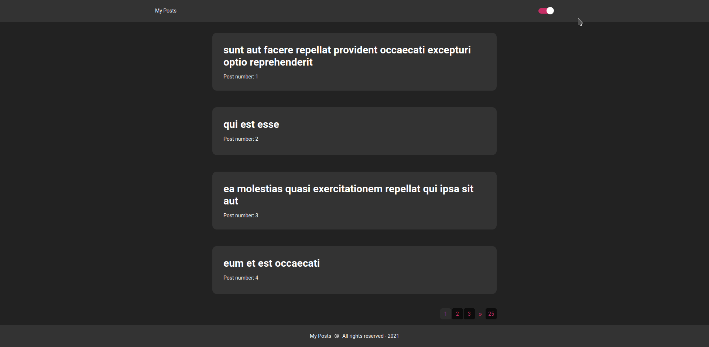

<p align="center">
  
</p>

<h1 align="center">My Posts</h1>
<p align="center">A place where you can find posts about anything you want.</p>

<h3 align="center">
  <a href="https://www.npmjs.com/" target="_blank">
    
  </a>
  <a href="#" target="_blank">
    
  </a>
  <a href="https://twitter.com/matheuseufra" target="_blank">
    
  </a>
</h3>

<br />

## Answering questions

1. Describe possible performance optimizations you could make to your
code itself.
```sh
Maybe would be better to the performance using a global state management, because when the user enters in the page of post, I had to do other request to the API and bring all the posts. If I have more time this would be the next thing I would.
```
2. What could you have improved?
```sh
Using more SEO, because the project is a blog so it need more SEO, and I would have implementd tests in this app using jest and @react-test-library.
```


## Running locally

Clone de repository, open its folder and install dependencies with:

```sh
yarn
```

Run it using:

```sh
yarn start
```

## See the application in production

<a target="_blank" href="https://my-posts-tau.vercel.app/">My Posts - Published on Vercel</a>

## Preview

Sample preview running the app:




## Usage & settings

After enter for the first time you will have access to Home page, which is where all the posts are. And by clicking on any post you can see it and the app will make 4 suggestions for others posts to  read.

### What I use

<ul>
  <li>Nextjs</li>
  <li>Typescript</li>
  <li>Styled Components</li>
  <li>Hooks</li>
  <li>Axios</li>
  <li>Polished</li>
  <li>React Icons</li>
  <li>React Switch</li>
</ul>

## Author

👤 **Matheus Eufrásio**

- Twitter: [@matheuseufra](https://twitter.com/matheuseufra)
- Github: [@matheuseufrasio2](https://github.com/matheuseufrasio2)
- LinkedIn: [@matheusveufrasio](https://www.linkedin.com/in/matheusveufrasio/)
